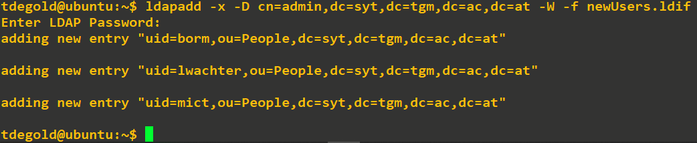
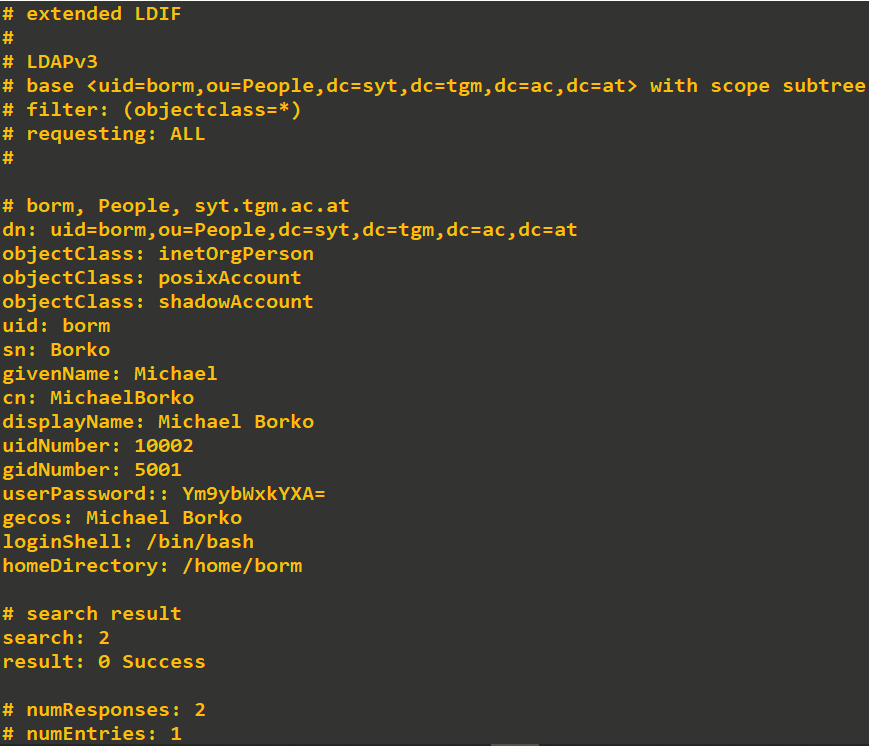
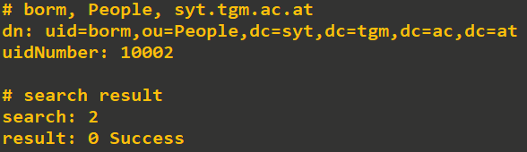
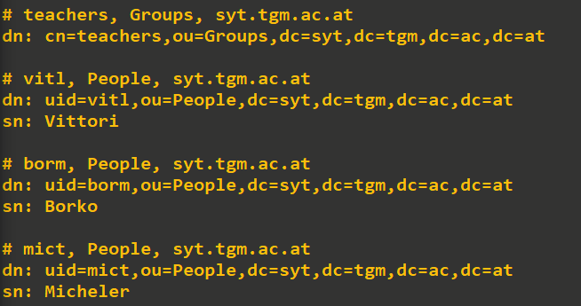
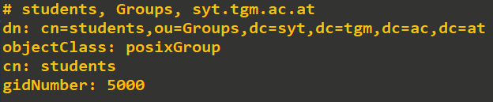
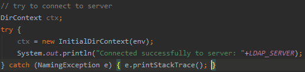
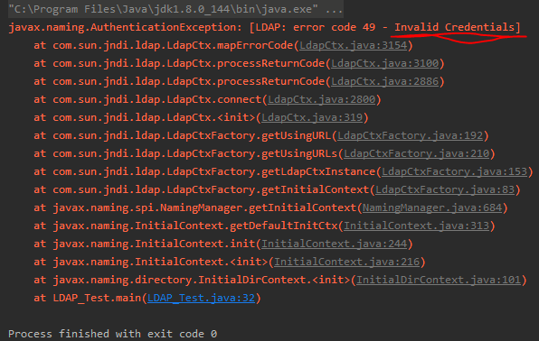
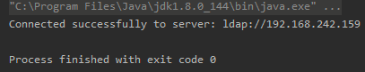
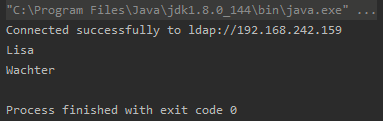

# EK734

Tim Degold, 4AHIT, begonnen am 18.1.2020

## Aufgabenstellung 

Eine detaillierte Aufgabenstellung kann [hier](TASK.md) nachgelesen werden.

## Vorbereitung und Recherche

Da, wie in der Aufgabenstellung beschrieben, keine VM zur Verfügung stand baue ich diese Übung auf GK723 von Prof. Umar auf. Dabei hatten wir einen simplen OpenLDAP-Server konfiguriert

```shell
username: tdegold
passwort: passwd
LDAP-root-user: admin
LDAP-root-passwort: root
dn: dc=syt,dc=tgm,dc=ac,dc=at
```

### LDAP | Lightweight Directory Access Protocol

LDAP ist ein Protokoll zur Durchführung von Abfragen und Änderungen in einem verteilten Verzeichnisdienst.[5] [7] 

Dabei ist die Aufgabe von LDAP simpel

> Ein über verschiedene Server verteiltes Verzeichnis in einer Baumstruktur soll einfach durchsucht werden können.

Dabei ist ganz oben in diesen Baum das *Root Directory*. Dieses verzweigt sich in Länder, Organisationen, Gruppen und Individuen (Individuen können Personen, Drucker, Scanner, Server, o.Ä. sein). 

**Mögliche Anwendungen**:

 \- Benutzerverwaltung
  \- Systemverwaltung
  \- Protokollzuordnung
  \- Organisation von Alias-Namen in E-Mail-Systemen
  \- Verwaltung von [DNS](https://www.ip-insider.de/was-ist-dns-domain-name-system-a-579256/) Zonendaten
  \- Organisation von [DHCP](https://www.ip-insider.de/was-ist-dhcp-a-590923/)-Servern

**Aufbau von LDAP**:

LDAP folgt weitgehend den Ideen der OOP. Jeder Eintrag stellt dabei ein Objekt dar, welches bestimmte Attribute hat. Das Pflichtattribut ist der sog. **D**istinguished **N**ame (dn) welcher jedes Objekt einzigartig macht. Nodes (bzw. Container) haben das Attribut **OU** als Identifier. 

Zusätzliche Attribute sind:

+ CN: commonName
+ L: localityName
+ ST: stateOrProvinceName
+ O: organizationName
+ OU: organizationalUnitName
+ C: countryName
+ STREET: streetAddress
+ DC: domainComponent
+ UID: userid
+ GID: groupid (weißt Individuen einer bestimmten Gruppe zu)

### JNDI | Java Naming and Directory Interface

JNDI ermöglicht es, sich über die Programmiersprache Java bei einem LDAP-Server zu authentifizieren und Abfragen bzw. Änderungen an Einträgen vorzunehmen. Es ist also eine Schnittstelle (API) für LDAP und Java.    Mehr dazu bei der [Implementierung](#impl)

## Umsetzung

### Gruppen und User anlegen

In GK 723 haben wir die Nodes `People` und `Groups` hinzugefügt. Zu `Groups` wurden 2 Gruppen, `students` und `teachers` hinzugefügt. Anschließend wurden die Personen `tdegold` (Student) und `vitl` (Teacher) zu den jeweiligen Gruppen hinzugefügt. Dazu wurde folgende [add_content](add_content.ldif).ldif-Datei erstellt.

Sämtliche Elemente konnten mit dem Befehl 

`ldapadd -x -D cn=admin,dc=syt,dc=tgm,dc=ac,dc=at -W -f add_content.ldif`

* -x: verwende `simple authentification` statt SASL[1]

* -D \<binddn\>: verwende den \<binddn\> (distinguished name [cn=admin,dc=syt,dc=tgm,dc=ac,dc=at]) für die LDAP-Datenbank. Wenn SASL verwendet wird, muss dieser Parameter ignoriert werden.[1]

* -W: der User wird nach dem LDAP-root-Passwort gefragt, statt es im `ldapadd`-Befehl anzugeben[1]

* -f \<file\>: ließ die Änderungen aus \<file\> aus[1]

  zur LDAP-Datenbank hinzugefügt werden.

Um nun EK734 gerecht zu werden füge ich noch [folgende User](newUsers.ldif) hinzu.

`ldapadd -x -D cn=admin,dc=syt,dc=tgm,dc=ac,dc=at -W -f newUsers.ldif` fügt die User hinzu.



### LDAPSEARCH-Abfragen

Grundsätzlich kann mit `dapsearch -x -LLL -H ldap:/// -b dc=syt,dc=tgm,dc=ac,dc=at` der gesamte Inhalt der LDAP-Datenbank ausgelesen werden.

Nun wollen wir 3 Suchanfragen durchführen. Eine Suche nach einer Bestimmten Person, eine Suche nach allen Lehrern und eine Suche nach der Gruppe `teachers`. [2]

```shell
ldapsearch -x -D cn=admin,dc=syt,dc=tgm,dc=ac,dc=at -W -b "<filter>" 
```

* -b "\<filter\>": die **B**ase ist quasi ein Regex, mit dem nach bestimmten Kriterien gesucht werden kann.
* -s {**base**|**one**|**sub**|**children**}: gibt das Scope (die Reichweite) der Suche an. Damit können Attribute und Kindelemente abgefragt werden.
* Nach dem Filter können noch Aspekte angegeben werden. So wird zum Beispiel nur die `uid` ausgegeben. Mehr dazu später.

#### Suche 1

Für die erste Suche lautet der Filter z.B. `uid=borm,ou=People,dc=syt,dc=tgm,dc=ac,dc=at`. Wir suchen also nach dem Herrn Prof. Borko. 



Wollen wir zum Beispiel nur die `uidNumber` des Herrn Professor, können mir das spezifizieren.

```shell
ldapsearch -x -D cn=admin,dc=syt,dc=tgm,dc=ac,dc=at -W -b "uid=borm,ou=People,dc=syt,dc=tgm,dc=ac,dc=at" uidNumber
```



#### Suche 2

In Suche 2 wollen wir die Nachnamen `sn` aller Lehrer. Wie stellen wir das an?[3]

```shell
ldapsearch -x -D cn=admin,dc=syt,dc=tgm,dc=ac,dc=at -W -b "dc=syt,dc=tgm,dc=ac,dc=at" -s sub "gidNumber=5001" sn
```



Als base geben wir die Domain an. Alles in der Domain soll also durchsucht werden. Als Umfang (Scope, daher auch -s) wählen wir `gidNumber=5001` da alle Lehrer in der Gruppe 5001 sind. Nun wollen wir von allen Lehrern nur den Nachnamen wissen. Daher `sn`.

#### Suche 3

Wenn nach Gruppen gesucht wird, muss das ebenfalls im Scope angegeben werden. In meinem Fall suche ich nach dem `cn`-Element.

```shell
ldapsearch -x -D cn=admin,dc=syt,dc=tgm,dc=ac,dc=at -W -b "dc=syt,dc=tgm,dc=ac,dc=at" -s sub "cn=students"
```

  

Dasselbe gilt ebenfalls für Nodes. Dann sucht man zum Beispiel nach dem `ou`-Element.

### Java Applikation mittels JNDI <a name="impl"></a>

Für diesen Teil der Übung erstelle ich in IntelliJ ein neues Projekt (EK734_LDAP). 

#### Verbinden und authentifizieren mit dem LDAP-Server

Um sich mit einem LDAP-Server zu verbinden muss ein DirectoryContext erstellt werden. Dieser benötigt eine *Umgebung* welche in Form einer Hashtable realisiert wird.[6] Den gesamten Code kann man [hier](src/LDAP_Test.java) einsehen.

```java
Hashtable env = new Hashtable();
env.put(Context.INITIAL_CONTEXT_FACTORY, FACOTY);
env.put(Context.PROVIDER_URL, LDAP_SERVER);
env.put(Context.SECURITY_AUTHENTICATION, AUTHENTIFICATION_METHOD);
env.put(Context.SECURITY_PRINCIPAL, LDAP_ROOT_USER);
env.put(Context.SECURITY_CREDENTIALS, LDAP_ROOT_USER_PASSWORD);
```

Nachdem man den Kontext erstellt hat kann man sich beim dem LDAP-Server authentifizieren.

```java
DirContext ctx = new InitialDirContext(env);
```



Sollte dabei etwas schiefgehen, wird eine ``NamingException` geworfen. Zu Testzwecken habe ich das falsche Passwort, `rot` statt `root`, angegeben. Als Error-Code wird der LDAP-Fehler angegeben. 



Sollte aber alles korrekt sein wird eine Success-Nachricht ausgegeben.



#### Abfragen über JNDI

Nachdem wir erfolgreich verbunden sind, können wir Abfragen durchführen.[8] [9] Gehen wir zurück zu unserer ersten LDAPsearch. Angenommen wir wissen, dass die `uid` einer Person ist 10003. Nun wollen wir Vor- und Nachnamen wissen.

Zuerst brauchen wir eine Searchbase.

```java
String search_base = "ou=People,dc=syt,dc=tgm,dc=ac,dc=at";
```

Wie wollen alle Individuen in `People`, welche in der Domain `dc=syt,dc=tgm,dc=ac,dc=at` vorhanden sind durchsuchen. 

Dann benötigen wir einen Filter. Dessen genauer Aufbau ist in [9] genau beschrieben.

```java
String filter = "(&(uidNumber=10003))";
```

Wir suchen ein Individuum mit der `uidNumber` 10003. 

Nun benötigen wir noch ein `SearchControls`-Objekt. In unserem Fall reicht es, alle Default Werte zu übernehmen. Diese sind vor allem bei großen Datenmengen sinnvoll, um die Ergebnisobjekte so klein wie möglich zu halten.

```java
SearchControls sc = new SearchControls();
```

Nun können wir unsere Suche in ein `NamingEnumeration`-Objekt speichern

```java
NamingEnumeration results = ctx.search(search_base, filter, sc);
```

und folgendermaßen in der Konsole ausgeben.

```java
while (results.hasMore()) {
	SearchResult sr = (SearchResult) results.next();
	Attributes attrs = sr.getAttributes();
	Attribute attr = attrs.get("givenName");
	System.out.println(attr.get());
	attr = attrs.get("sn");
	System.out.println(attr.get());
}
```

Somit werden `givenName` und `sn` ausgegeben.

#### Resultat



## Quellen

[1] http://www.openldap.org/software//man.cgi?query=ldapadd&sektion=1&apropos=0&manpath=OpenLDAP+2.4-Release

[2] https://linux.die.net/man/1/ldapsearch

[3] https://access.redhat.com/documentation/en-US/Red_Hat_Directory_Server/8.2/html/Administration_Guide/Examples-of-common-ldapsearches.html

[4] https://stackoverflow.com/questions/21475327/how-can-i-get-data-from-ldap-with-jndi

[5] https://de.wikipedia.org/wiki/Verzeichnisdienst

[6] https://www.javaworld.com/article/2076073/ldap-and-jndi--together-forever.html

[7] https://www.ip-insider.de/was-ist-ldap-lightweight-directory-access-protocol-a-581204/

[8] http://www.java2s.com/Code/Java/JNDI-LDAP/LDAPSearch.htm

[9] https://docs.oracle.com/javase/tutorial/jndi/ops/filter.html